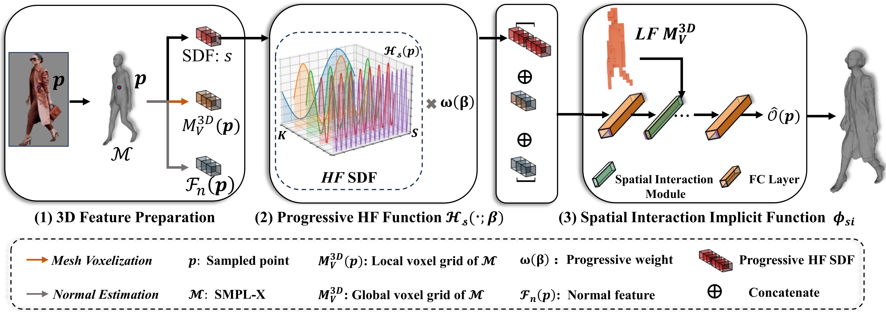

<!-- PROJECT LOGO -->

<p align="center">

  <h1 align="center">HiLo: Detailed and Robust 3D Clothed Human Reconstruction with High-and Low-Frequency Information of Parametric Models</h1>
  <p align="center">
    <strong>Yifan Yang</strong></a>
    ·
    <strong>Dong Liu</strong></a>
    ·
    <strong>Shuhai Zhang</strong></a>
    ·
    <strong>Zeshuai Deng</strong></a>
    .
    <strong>Zixiong Huang</strong></a>
    .
    <strong>Mingkui Tan</strong></a>
  </p>
  <h2 align="center">CVPR 2024</h2>

  <p align="center">
  <br>
    <a href='https://arxiv.org/abs/2404.04876'>
      
    </a>
  </p>
</p>

<br>
<div align="center">
    
  </div>


<br/>

<!-- TABLE OF CONTENTS -->
<details open="open" style='padding: 10px; border-radius:5px 30px 30px 5px; border-style: solid; border-width: 1px;'>
  <summary>Table of Contents</summary>
  <ol>
    <li>
      <a href="#introduction-to-HiLo">Introduction to HiLo</a>
    </li>
    <li>
      <a href="#running-demo">Running Demo</a>
    </li>
    <li>
    <a href="#training-and-testing">Training and testing</a>
    </li>
    <li>
      <a href="#citation">Citation</a>
    </li>
  </ol>
</details>

<br>


## Introduction-to-CR-NeRF 
|                             |
| :----------------------------------------------------------: |
|       _Pipeline of HiLo_       |        
- If you want to **Train & Evaluate**, please check [installation.md](assets/installation.md) to prepare environment, required models and extra data. Please check [dataset.md](assets/dataset.md) to prepare THuman2.0 and CAPE dataset, see
<a href="#training-and-testing">Training and testing</a> to train and benchmark HiLo using the prepared datasets.

- If you want to **Running Demo**, please see
<a href="#running-demo">Running Demo</a>.

Giving a RGB image of clothed human, with our HiLo, you will get:
  - image:
    - with the normals of smpl and cloth
  - mesh:
    - with the 3d objects of smpl, reconstructed and refined cloth
  - video:
    - showing the reconstructed human from all angles

<br>

## Running Demo

```bash
#Set $in_dir, $out_dir and cuda devices in command/infer.sh
bash command/infer.sh
```
The reconstructed results (mesh, image, video) will be in path "{$out_dir}".

## Training and testing

**If you want to train and test the model**

```bash
#Set experiment name and cuda devices in train_and_test.sh 
bash command/train_and_test.sh
```

**If you only want to test the model**

```bash
#Set the experiment name to match the training name, and set cuda devices in test_only.sh  
bash command/test_only.sh
```


## Citation

```bibtex
@misc{yang2024hilo,
      title={HiLo: Detailed and Robust 3D Clothed Human Reconstruction with High-and Low-Frequency Information of Parametric Models}, 
      author={Yifan Yang and Dong Liu and Shuhai Zhang and Zeshuai Deng and Zixiong Huang and Mingkui Tan},
      year={2024},
      eprint={2404.04876},
      archivePrefix={arXiv},
      primaryClass={cs.CV}
}
```

## Acknowledgments

Here are some great resources we benefit from:

- [ICON](https://github.com/YuliangXiu/ICON.git) 
- [ECON](https://github.com/YuliangXiu/ECON.git)
- [THuman2.0](https://github.com/ytrock/THuman2.0-Dataset.git)

<br>


