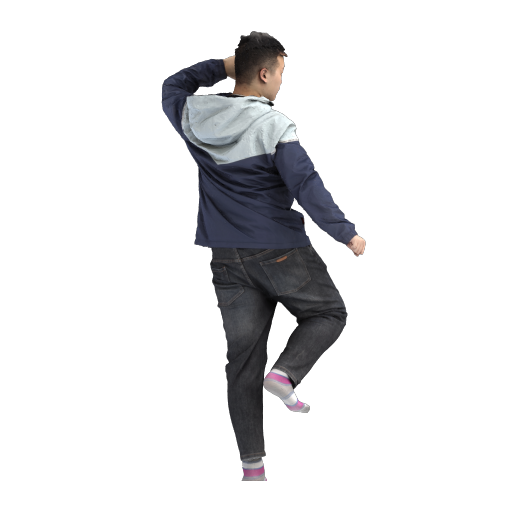
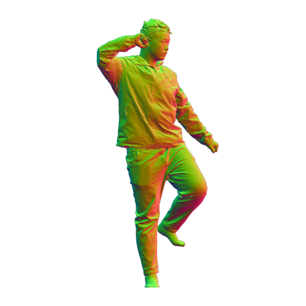
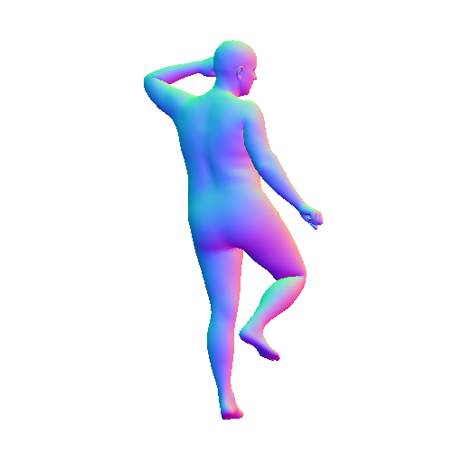
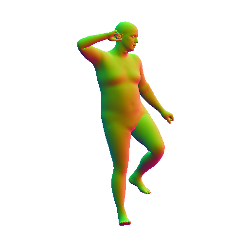
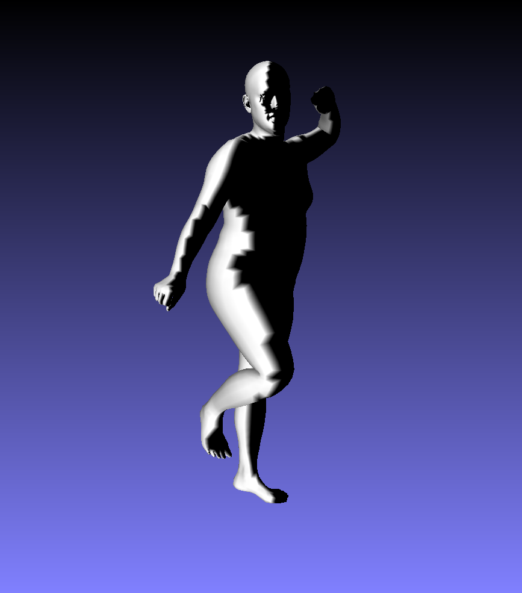
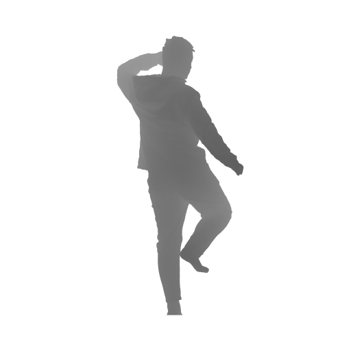
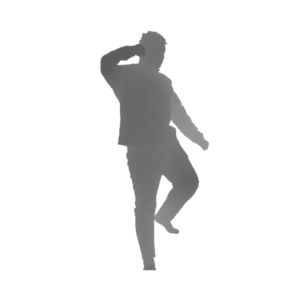
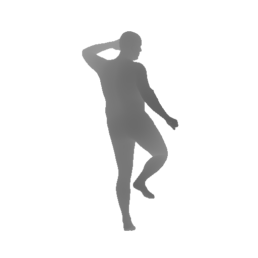
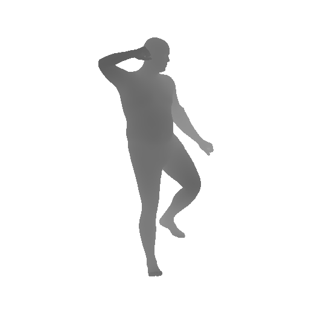

## Environment 

  * freeglut (`sudo apt-get install freeglut3-dev`)
  * (optional) **EGL** used for headless rendering (`apt install libgl1-mesa-dri libegl1-mesa libgbm1`)

:warning: For **EGL** headless rendering (without screen, such as clusters), please `export PYOPENGL_PLATFORM=egl` before running these scripts, otherwise, `unset PYOPENGL_PLATFORM`.

:warning: If the program runs so slowly and is stuck in `mesh.ray.intersects_any`, it's because the trimesh is using the default triangle intersection function. Use `Pyembree` will accelerate the intersection computation. You can install `embree`, `pyembree`, `trimesh` via
```
conda install -c conda-forge embree=2.17.7
conda install -c conda-forge pyembree
```
and test the installation via
`from pyembree import rtcore_scene` and `print(trimesh.ray.ray_pyembree.error)`. If the error is `ray_pyembree has no attribute error`, then you are good to go.

## THuman2.0

Please refer to [THuman2.0-Dataset](https://github.com/ytrock/THuman2.0-Dataset) to download the original scans into `data/thuman2/scans`. Then generate `all.txt` by `ls > ../all.txt` under `data/thuman2/scans`, which contains all the subject names (0000~0525). 

The SMPL and SMPLX fits could be downloaded as follows: 

```bash
wget https://download.is.tue.mpg.de/icon/SMPL-X.zip --no-check-certificate -O ./data/thuman2/SMPL-X.zip
unzip ./data/thuman2/SMPL-X.zip -d ./data/thuman2/
rm ./data/thuman2/SMPL-X.zip
```

:eyes: `./sample_data` contains one example of THuman2.0 which shows the data folder structure. Note that PaMIR only support SMPL, if you want to use SMPL-X instead, please refer to `./scripts/tetrahedronize_scripits` to generate necessary data used for voxelization.

## Debug Mode

```bash
conda activate icon
python -m scripts.render_batch -debug -headless
python -m scripts.visibility_batch -debug
```

Then you will get the rendered samples & visibility results under `debug/`

## Generate Mode 

**1. Rendering phrase**: RGB images, normal images, calibration array. *If you need the depth maps, just update `render_batch.py` as follows* 

```python
render_types = ["light", "normal"]
--->
render_types = ["light", "normal", "depth"]
```

Then run **render_batch.py**, which will take 20min for THuman2.

```bash
conda activate icon
python -m scripts.render_batch -headless -out_dir data/
```

**2. Visibility phrase**: SMPL-X based visibility computation

```bash
python -m scripts.visibility_batch -out_dir data/
```


:white_check_mark: NOW, you have all the synthetic dataset under `data/thuman2_{num_views}views`, which will be used for training. 

:arrow_right: NEXT, please jump to [training-and-testing](../README.md#training-and-testing) for more details.

## Examples

||||||
|---|---|---|---|---|
|RGB Image|Normal(Front)|Normal(Back)|Normal(SMPL-X, Front)|Normal(SMPL-X, Back)|
||||||
|Visibility|Depth(Front)|Depth(Back)|Depth(SMPL-X, Front)|Depth(SMPL-X, Back)|

## Citation
If you use this dataset for your research, please consider citing:
```
@InProceedings{tao2021function4d,
  title={Function4D: Real-time Human Volumetric Capture from Very Sparse Consumer RGBD Sensors},
  author={Yu, Tao and Zheng, Zerong and Guo, Kaiwen and Liu, Pengpeng and Dai, Qionghai and Liu, Yebin},
  booktitle={IEEE Conference on Computer Vision and Pattern Recognition (CVPR2021)},
  month={June},
  year={2021},
}
```
This `PyTorch Dataloader` benefits a lot from [MonoPortDataset](https://github.com/Project-Splinter/MonoPortDataset), so please consider citing:

```
@inproceedings{li2020monoport,
  title={Monocular Real-Time Volumetric Performance Capture},
  author={Li, Ruilong and Xiu, Yuliang and Saito, Shunsuke and Huang, Zeng and Olszewski, Kyle and Li, Hao},
  booktitle={European Conference on Computer Vision},
  pages={49--67},
  year={2020},
  organization={Springer}
}
  
@incollection{li2020monoportRTL,
  title={Volumetric human teleportation},
  author={Li, Ruilong and Olszewski, Kyle and Xiu, Yuliang and Saito, Shunsuke and Huang, Zeng and Li, Hao},
  booktitle={ACM SIGGRAPH 2020 Real-Time Live},
  pages={1--1},
  year={2020}
}
```

